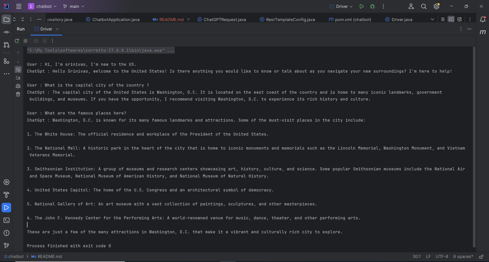

# Chat-bot

This Spring Boot application has been developed as part of an assignment with the goal of creating a chatbot. Its purpose is to interact with users, processing their inputs using ChatGPT API and generating responses. The chatbot leverages the context of previous conversations to enhance its responses and improve user experience.


## Technologies Used:
- 	Java
- 	Spring Boot
- 	Open AI Rest API

## Prerequisites

- Java Development Kit (JDK) 17
-	IntelliJ IDEA / Eclipse

## Steps to run the application
1. Clone or download the Spring Boot project from the repository (if not already available).    
   ```bash
   https://github.com/srinivasa8/chat-bot.git
2.	Open the project using an IDE like IntelliJ IDEA, Eclipse, or Spring Tool Suite.
3. Using the terminal or within your IDE, execute mvn clean install to build the project and ensure the build completes successfully without any errors.
4. Locate the Driver class file and replace the values for below variables
    ```bash
        String apiKey = "{OPENAI_API_KEY}";
        String apiUrl = "{OPENAI_API_URL}";
   
5.	Run the Driver class to start the application.
6.	Once the application runs, Please Check the console output for the output as shown below:



